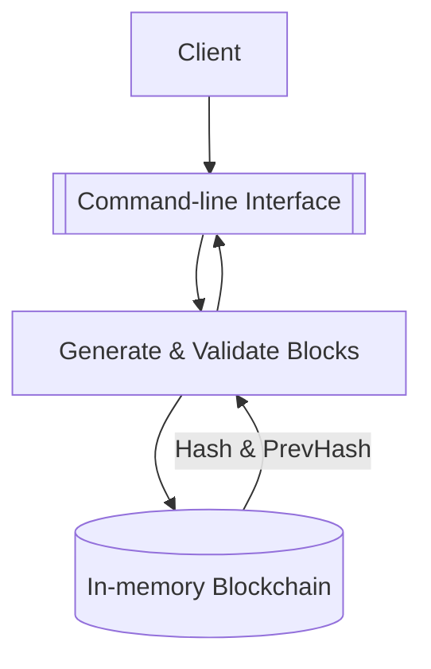

# Request Flow

This project does not expose an HTTP API or persistent database. Blocks are stored in-memory as a slice. The flow below represents how the CLI interacts with the blockchain in `main.go`.

1. **User** runs the program from the command line.
2. **CLI** calls the blockchain functions defined in `main.go`.
3. **Logic** handles block generation and validation.
4. **Chain** acts as the in-memory database storing blocks.

If the `-output` flag is provided, the CLI also writes the chain to a JSON file.

